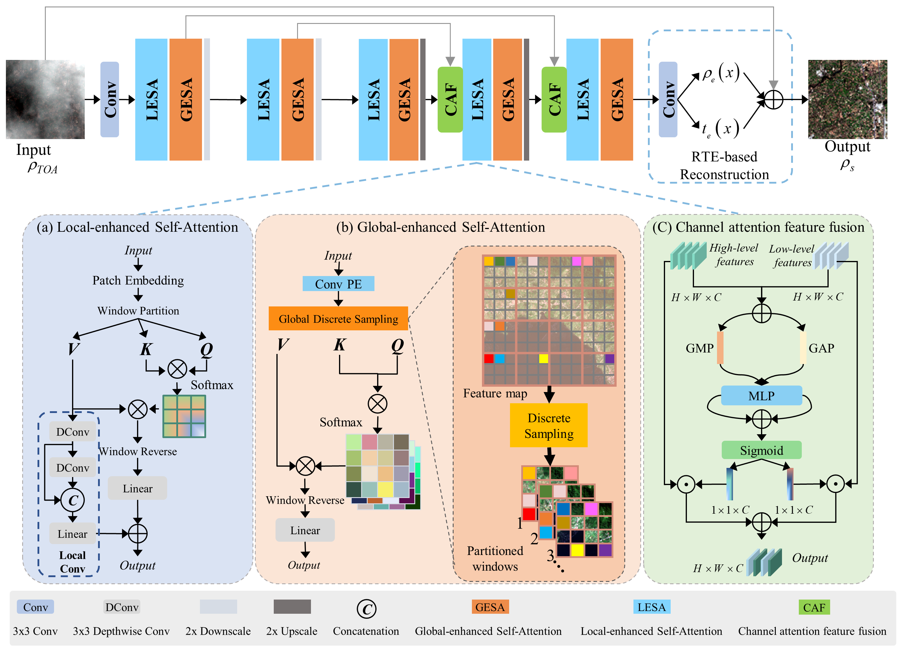
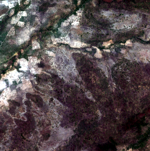

# RTFormer:Radiative Transfer Model-Coupled Transformer for Cloud Removal in Optical Remote Sensing Imagery
We have proposed a new cloud removal model\
\
Moreover,we have created a new Radiative Transfer Model (RTM) driven cloud simulation synthesis dataset(RTCR).\
Cloud free image:\
\
RTM simulated cloud image:\
\
#data sets
The dataset used in the paper can be found at [RSHaze](https://drive.google.com/drive/folders/1Yy_GH6_bydYPU6_JJzFQwig4LTh86VI4)\
Our dataset can be found at [RTCR](https://zenodo.org/records/16534169)
